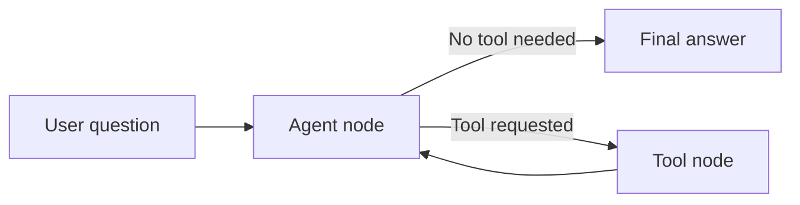

# Learning LangGraph and Multi-Tool Calling

This is a small learning project for building an AI decision agent.

The agent uses Google Gemma 3 through Amazon Bedrock. It can answer directly or ask tools for live weather and travel distance data. LangGraph controls the flow between the model and the tools.

## What this project covers

1. Call an LLM with Amazon Bedrock.
2. Validate structured JSON output with Pydantic.
3. Track token usage and latency.
4. Define and execute a tool call.
5. Get live weather data from Open-Meteo.
6. Build a basic LangGraph workflow.
7. Route between weather, road distance, flight distance, and direct answers.

## Agent flow



The model does not run tools by itself. It returns a structured tool request. Python runs the selected function, adds its result to the conversation, and calls the model again.

## Project structure

```text
learning-langgraph/
├── notebooks/
│   ├── 01_bedrock_llm_call.ipynb
│   ├── 02_structured_output_and_usage.ipynb
│   ├── 03_basic_tool_calling.ipynb
│   ├── 04_live_weather_tool.ipynb
│   ├── 05_langgraph_basics.ipynb
│   └── 06_multi_tool_agent.ipynb
├── src/learning_langgraph/
│   └── weather.py
├── tests/
│   └── test_weather.py
├── .env.example
├── .gitignore
└── pyproject.toml
```

## Setup

Install [uv](https://docs.astral.sh/uv/) and run:

```bash
uv sync --system-certs
```

If your network does not need system certificates, `uv sync` is enough.

Create a local `.env` file from `.env.example`:

```bash
cp .env.example .env
```

Add your real Bedrock API key only to `.env`. Never commit that file.

Start Jupyter or open the notebooks in VS Code. Select the Python environment created by uv.

## Tests

Run:

```bash
uv run pytest
```

The tests cover the weather helper without making live network calls.

## Data sources

- Open-Meteo provides free weather and geocoding data.
- OSRM provides road distance and driving duration.
- Flight distance uses the Haversine formula between airport coordinates.

These free services are useful for learning. They are not a complete production travel service.

## Known model behavior

Gemma 3 may sometimes write a tool call as normal text when tool choice is set to `auto`. In that case, the SDK does not return a real `tool_calls` object and Python cannot execute the tool. A forced tool call is more reliable for the early lessons.

The final notebook keeps automatic tool selection as a learning experiment. A production agent should add tool-call validation, retries, and tests with the selected model and endpoint.

## Next learning steps

- Save conversation state with a LangGraph checkpointer.
- Add structured final decisions.
- Add Google Calendar.
- Add retry and error-handling nodes.
- Add evaluation cases for tool selection and answer quality.
- Add live fitness data later.
